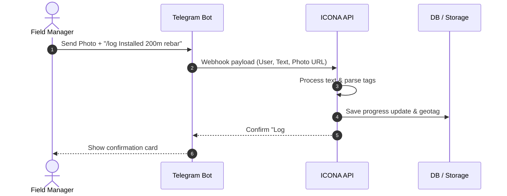

# 🔗 Integrations & Workflows

Return to [[00 - Index MOC]]

This document outlines the external services, bot integrations, form handlers, and backend roadmap powering **ICONA**.

---

## 💬 1. Telegram Bot Integration

The Telegram integration enables instant field to office communication, allowing site managers and contractors to log site events directly from Telegram.



### Supported Bot Commands
- `/status [project_id]`: Fetch live completion summary and cash position.
- `/log [message]`: Record daily site activity log with optional attached photos.
- `/boq [item_code]`: Check remaining quantities and budget for specific items.
- `/alert [issue]`: Flag urgent material shortages or safety hazards to supervisors.

---

## ✉️ 2. Formspree Contact Form Workflow

The marketing site (`src/components/website/Contact.jsx`) handles contact and demo requests client side without needing a server backend:

1. User completes name, email, company size, and project message.
2. `Contact.jsx` validates input fields client side.
3. Form submits an asynchronous `POST` request directly to Formspree endpoint.
4. UI transitions into an animated success badge using ICONA brand tokens (`text-success`, `bg-card`).

---

## 🤖 3. LLM Assistant & Prompt Engine

Located in `src/app/(admin)/admin/llm/page.tsx`:
- **Admin Configuration**: Provides tools to fine tune system prompts, model temperatures, and context windows.
- **Context Injection**: Automatically injects site data (`SITE_CONFIG` and project data) into assistant context for accurate responses.
- **Document Processing**: Uses LLM agents to extract structured JSON data from uploaded PDF BOQs and invoices.

---

## 🗄️ 4. Backend & Prisma Database Roadmap

While the website repository is presentational, the system is designed to connect seamlessly with PostgreSQL via **Prisma ORM**:

```
prisma/
└── schema.prisma          # Data models: User, Organization, Project, BOQItem, Expense, Attendance
```

Key entities planned:
- **Organization**: Multi tenant account boundary.
- **Project**: Represents construction site, start/end dates, budget.
- **BOQItem**: Individual work items, planned quantities, unit prices.
- **Expense**: Accounts payable, vendor invoices, petty cash disbursements.

---

## 🔗 Related Notes

- Map Hub: [[00 - Index MOC]]
- System Architecture: [[02 - System Architecture & Tech Stack]]
- Feature Modules: [[05 - Modules & Features Map]]
- Development Guidelines: [[07 - Development & Agent Guidelines]]
