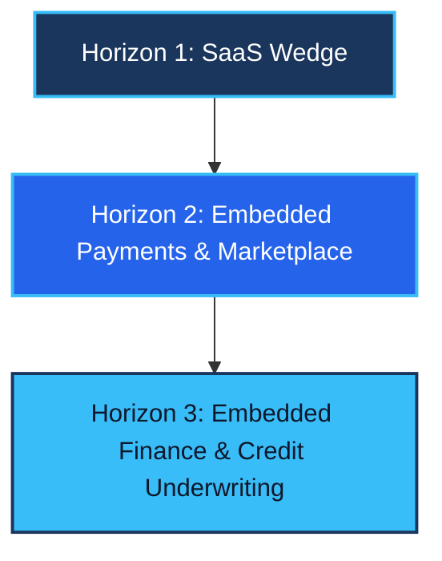

# ICONA - Project Concept & Business Strategy

This document defines the core business concept, market opportunity, go-to-market (GTM) strategy, pricing model, and growth roadmap for **ICONA**. It outlines how the platform addresses critical operational challenges in the construction sector, specifically focusing on small and medium enterprises (SMEs) in emerging markets, starting in Pakistan.

---

## 1. The Core Idea & Product Vision (What We Want)

### The Problem: Fragmented Operations & Accountability Gaps
In the construction sector in Pakistan, the vast majority of projects are managed with high operational risk and zero centralized records:
* **The "WhatsApp & Memory" Trap:** Project updates, daily expenses, and material requests are scattered across chaotic WhatsApp groups or live only in a supervisor's head. There is no unified history, leading to constant double-entry and lost information.
* **Material Recalculation Fatigue:** Estimating materials is manual. When discrepancies occur, contractors must waste days recalculating quantities on paper or Excel, causing project delays.
* **Labour Attendance Fraud:** Site supervisors often log attendance manually, creating opportunities for corruption (e.g., claiming daily wages for workers who did not show up or padding the labour count).
* **Owner Captivity:** Because the records are unreliable, the business owner must spend their entire day visiting construction sites physically to monitor workers, audit cash, and count materials. They are trapped in day-to-day firefighting instead of growing the business.

### The Solution: A Unified, Mobile-First Operating System
ICONA provides a single, connected system of record that links the site directly to the office. It is designed to be simple enough for site supervisors to use on their phones, yet robust enough for corporate accountants and business owners:
1. **Unified Ledger:** Replaces scattered spreadsheets with a double-entry ledger tracking budget versus actual costs in real time.
2. **Anti-Fraud Site Log:** Site supervisors capture daily attendance and photo logs on-site through an Android app that works offline. It records location and photo metadata, eliminating manual log manipulation.
3. **Structured BOQ (Bill of Quantities):** Connects estimation sheets to active projects, automatically updating remaining material balances as site logs are completed.
4. **Owner Dashboard:** Gives the owner instant visibility of all active projects, cash positions, and labour attendance from any device, freeing them from constant site visits.

---

## 2. Market Potential (The Opportunity)

### Macro Context (Pakistan)
* **Economic Pillar:** The construction sector is the second-largest employer in Pakistan and typically contributes between 2.2% and 2.5% to the national GDP.
* **Large Untapped SME Base:** While public infrastructure gets the headlines, private SME projects (residential, commercial plazas, and subcontracts) represent a massive market. These firms are run by a new generation of younger, tech-literate managers who are eager to adopt digital tools.
* **Digital Infrastructure:** Pakistan has reached the digital enablement threshold. With over 70% smartphone penetration, 64% broadband penetration, and 4G coverage across 97% of cell sites, field workers can finally run mobile business software reliably on-site.

### Bottoms-Up TAM, SAM, SOM (Pakistan SME Focus)
* **Total Addressable Market (TAM):** The global construction ERP software market is valued at approximately $4 billion to $5 billion, growing at an 8% to 9.5% annual rate.
* **Serviceable Addressable Market (SAM):** The construction software market for SMEs in developing countries across South Asia and the Middle East, representing a multi-million-dollar opportunity.
* **Serviceable Obtainable Market (SOM):** The initial target of capturing 1,500 active construction SMEs (both small contractors and mid-size developers) in Pakistan's major urban centers (Lahore, Karachi, Islamabad-Rawalpindi). Even at a conservative subscription price, this initial footprint yields a highly profitable SaaS business model.

---

## 3. Go-To-Market & Market Capture Strategy (How We Win)

Emerging-market contractors are traditionally resistant to complex enterprise software. To overcome this, ICONA uses a highly localized, high-value entry strategy.

### The Product Wedge: Zero-Friction Site Onboarding
Instead of selling a complex ERP that takes months to configure, ICONA sells a "quick-win" solution:
* **The WhatsApp-Style Input:** We allow site supervisors to log expenses and attendance via a simple chat interface (like Telegram or WhatsApp) that syncs directly with the ERP. This minimizes training time and ensures rapid field adoption.
* **Immediate Value for the Owner:** Within 48 hours of starting, the owner gets a clean, fraud-resistant overview of daily attendance and material usage on their phone.

### The Compliance Hook: PEC Licensing Integration
The Pakistan Engineering Council (PEC) requires construction firms (from C-6 to C-A categories) to meet strict criteria for annual license renewal and project bidding:
* **Engineering Registry:** ICONA maps to PEC licensing requirements. It stores and organizes engineer profiles, valid PEC registration cards, and project participation records.
* **Operational History:** When a firm applies for license renewal or bids for a public project, they must submit audited project histories. ICONA generates structured project completion reports and cash flow ledgers that satisfy PEC requirements with one click.
* **Step-by-Step Compliance Checklist:** ICONA guides companies through the precise regulatory actions needed to upgrade their PEC status (e.g., from C-6 to C-5, C-5 to C-4), creating an indispensable operational partnership.

### Sales & Trust Loops
* **Direct Sales Wedge:** Founder-led sales targeting contractors in Lahore, Karachi, and Islamabad, offering on-site onboarding assistance.
* **Subcontractor Referral Loop:** When a main contractor uses ICONA, they add their subcontractors to the platform to track payouts. Subcontractors get exposed to the tool and subsequently purchase their own subscriptions to manage their independent projects.

---

## 4. Costing & Subscription Model (How We Monetize)

To remove payment friction, ICONA prices its subscriptions in local PKR currency and supports local billing methods (such as direct bank transfers, Raast, and digital wallets).

| Plan | Pricing (PKR / Month) | Target Audience | Key Features & Limits |
| :--- | :--- | :--- | :--- |
| **Starter** | **PKR 9,999** | Small Contractors (5-15 staff, 1-2 active sites) | Up to 5 projects, 3 team members, basic ledger, and site attendance log. |
| **Growth** | **PKR 14,999** | Mid-Size Developers (20-50 staff, 3-5 active sites) | Up to 25 projects, 15 team members, detailed BOQ tracking, and client portal. |
| **Enterprise** | **Contact Sales** | Large Scale Firms / Asset Owners | Unlimited projects and members, custom reporting, multi-level approvals, and free AI Copilot. |

### Localization Policies
* **Annual Billing Incentive:** Clients who choose annual billing pay for 10 months and get 12 months (2 months free).
* **Payment Friction Removal:** In Pakistan, international credit card payments face heavy taxation and banking restrictions. ICONA accepts local bank transfers, auto-reconciling them using unique reference IDs.

---

## 5. Growth & Scale Roadmap (How We Grow)

ICONA's growth model is structured into three horizons, transitioning the company from a subscription tool to a central ecosystem platform.

### Horizon 1: SaaS Domination & Data Collection (Months 0-12)
* **Objective:** Focus entirely on user acquisition and retention in Pakistan's primary cities.
* **Product Enhancements:** Build the AI Copilot (supporting Roman Urdu voice queries for site supervisors), implement offline mobile sync, and roll out the PEC compliance checklists.
* **Outcome:** Secure the core business data (project budgets, material rates, and labour attendance) in our database.

### Horizon 2: Ecosystem Integration & The Distributor Marketplace (Months 12-24)
* **The Distributor Value Proposition:** Major manufacturers (such as Lucky Cement, Mughal Steel, Amreli Steels, Berger Paints) and local distributors struggle to reach thousands of scattered contractors directly. They rely on multi-tier dealer networks that dilute their margins.
* **Direct RFQ and Purchasing Loops:** ICONA connects contractors directly with these primary distributors. When a contractor reaches a milestone requiring materials (e.g., foundation pouring), they select the steel or cement item directly from their ICONA Bill of Quantities (BOQ) and click "Request Quotes." 
* **Geographic Matching:** ICONA automatically broadcasts a request for quote (RFQ) to certified distributors within the project's geographic area. Distributors submit quotes directly to the contractor's dashboard, ensuring price transparency and eliminating kickbacks or leakage by purchasing staff.
* **Revenue Model:** ICONA earns a transaction commission (0.5% to 2%) on successful procurement orders routed through the platform, while distributors pay a subscription fee for premium placement and regional demand-forecasting insights.
* **E-Invoicing and Tax Compliance:** Integrate with the Federal Board of Revenue (FBR) e-invoicing systems, ensuring that tax calculations and filings are automated straight from the cash ledger.

### Horizon 3: Embedded Finance & The Banking Bridge (Months 24-48)
* **The SME Credit Bottleneck:** Construction is cash-flow intensive, but local commercial banks hesitate to lend to construction SMEs due to a complete lack of financial transparency, reliable project histories, or formal auditing.
* **The Risk-Scoring Engine:** ICONA acts as a data bridge. We partner with commercial banks to offer working-capital loans and project-specific financing. Because we hold the contractor's historical cash ledgers, verified subcontractor logs, real-time material audits, and cost-variance metrics, we can provide banks with a real-time risk profile of the firm.
* **Disbursement Safety Controls:** To minimize credit diversion, bank loans are disbursed directly to verified material distributors on the ICONA marketplace to buy goods for that specific project, rather than sending unrestricted cash to the contractor.
* **PEC Scorecard Integration:** We combine a firm's operational history with their PEC engineering registry status to create a specialized "Construction Credit Score" that no traditional credit bureau can replicate.
* **Revenue Model:** ICONA charges an origination fee (1% to 1.5% of the loan value) to the lending bank, creating a high-margin fintech revenue stream from a customer base acquired through low-cost SaaS.
* **Regional Expansion:** Replicate the playbook in other emerging regions with similar informal economies and digital trends, including Bangladesh, the Middle East (MENA), and parts of Africa.

